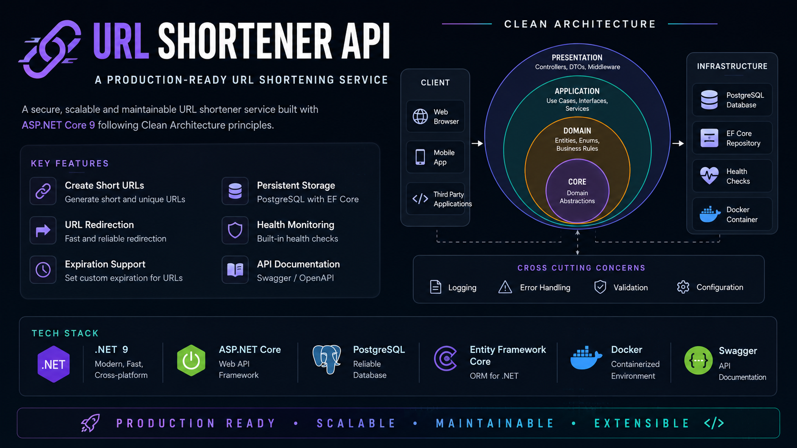
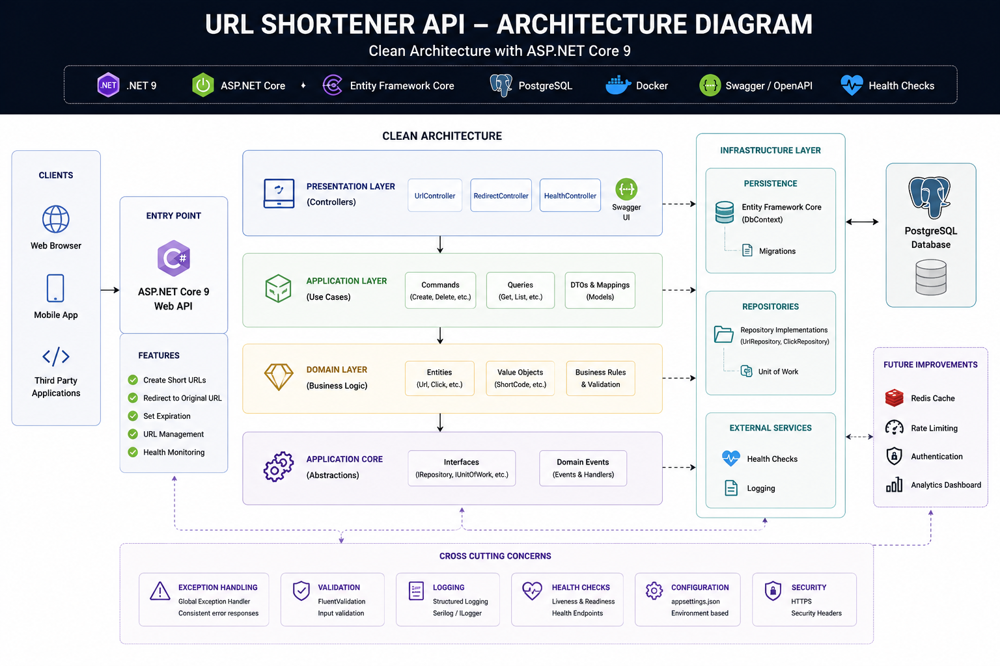
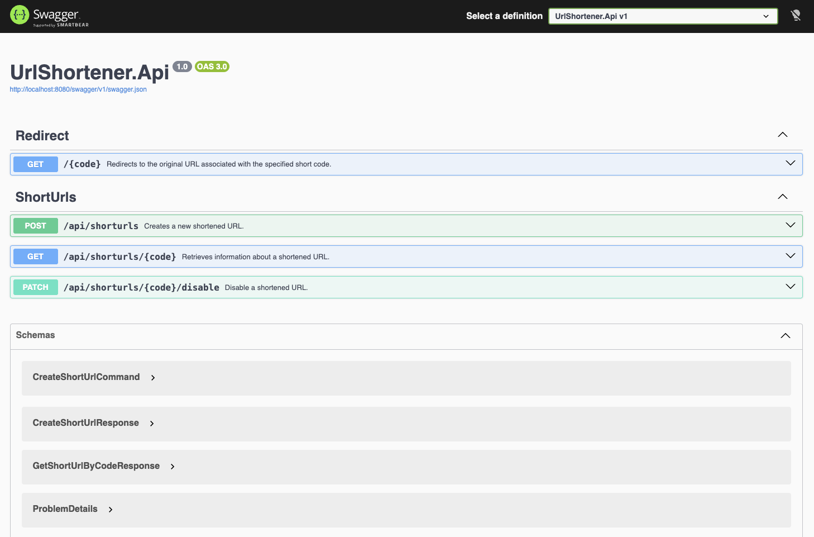

# URL Shortener API

[](https://github.com/iamalijafari/UrlShortener/actions/workflows/ci.yml)


<p align="center">
    
</p>

A production-ready URL Shortener API built with **ASP.NET Core 9** using **Clean Architecture**, **Domain-Driven Design (DDD)**, and **CQRS**. Designed with **maintainability**, **scalability**, and **testability** in mind.

This project demonstrates modern backend engineering practices including layered architecture, MediatR, FluentValidation, Entity Framework Core, PostgreSQL, Docker, Health Checks, centralized exception handling, and comprehensive testing.

---

# Features

## Functional Features

- Create shortened URLs
- Redirect users using short URLs
- Retrieve URL information
- Disable shortened URLs
- URL expiration support

## Technical Features

- Clean Architecture
- Domain-Driven Design (DDD)
- CQRS with MediatR
- FluentValidation
- Repository Pattern
- Global Exception Handling
- Health Checks
- Docker Support
- Automatic Database Migration
- Unit & Integration Testing

---

# Architecture

<p align="center">
    
</p>

The solution follows **Clean Architecture** to separate business logic from infrastructure and presentation concerns while maintaining a highly testable and extensible codebase.

```
src
│
├── UrlShortener.Api
├── UrlShortener.Application
├── UrlShortener.Domain
└── UrlShortener.Infrastructure

tests
│
├── UrlShortener.Api.Tests
└── UrlShortener.Domain.Tests
```

Dependency Flow

```
Presentation (API)
        │
        ▼
Application
        │
        ▼
Domain
        ▲
        │
Infrastructure
```

The **Domain** layer has **zero dependency** on frameworks or external libraries.

---

# Project Structure

| Project                     | Responsibility                                  |
| --------------------------- | ----------------------------------------------- |
| UrlShortener.Api            | API endpoints, middleware, dependency injection |
| UrlShortener.Application    | Use cases, CQRS handlers, validation            |
| UrlShortener.Domain         | Business rules, entities, domain abstractions   |
| UrlShortener.Infrastructure | Entity Framework Core, PostgreSQL, repositories |

---

# Design Principles

- Clean Architecture
- Domain-Driven Design (DDD)
- CQRS
- SOLID Principles
- Dependency Injection
- Separation of Concerns
- Repository Pattern
- Validation Pipeline
- Testability
- Scalability

---

# Tech Stack

| Technology            | Purpose              |
| --------------------- | -------------------- |
| ASP.NET Core 9        | Web API              |
| C#                    | Programming Language |
| Entity Framework Core | ORM                  |
| PostgreSQL            | Database             |
| MediatR               | CQRS                 |
| FluentValidation      | Validation           |
| Swagger / OpenAPI     | API Documentation    |
| Docker                | Containerization     |
| xUnit                 | Testing              |

---

# API Endpoints

| Method | Endpoint                        | Description              |
| ------ | ------------------------------- | ------------------------ |
| POST   | `/api/shorturls`                | Create a shortened URL   |
| GET    | `/api/shorturls/{code}`         | Retrieve URL information |
| GET    | `/{code}`                       | Redirect to original URL |
| PATCH  | `/api/shorturls/{code}/disable` | Disable a shortened URL  |
| GET    | `/health`                       | Health Check             |

---

# Swagger UI

<p align="center">
    
</p>

Interactive API documentation is available via Swagger.

```
http://localhost:8080/swagger
```

---

# Validation

Validation is implemented using **FluentValidation** together with **MediatR Pipeline Behaviors**.

Example validation scenarios:

- Invalid URLs
- Empty requests
- Invalid short codes
- Business rule validation

---

# Exception Handling

A centralized exception handling middleware provides consistent API responses.

Handled exceptions include:

- ValidationException
- NotFoundException
- DomainException
- Unexpected Exceptions

---

# Docker Support

Run the complete application with Docker.

```bash
docker compose up --build
```

Services started:

- ASP.NET Core API
- PostgreSQL

EF Core migrations are automatically applied on startup.

---

# Running Locally

## Requirements

- .NET 9 SDK
- PostgreSQL 17

Clone repository

```bash
git clone https://github.com/iamalijafari/UrlShortener.git
```

Navigate

```bash
cd UrlShortener
```

Configure

```json
"ConnectionStrings": {
  "DefaultConnection": "Host=localhost;Port=5433;Database=UrlShortener;Username=postgres;Password=postgres"
}
```

Apply migrations

```bash
dotnet ef database update
```

Run

```bash
dotnet run --project src/UrlShortener.Api
```

---

# Running with Docker

```bash
docker compose up --build
```

Swagger

```
http://localhost:8080/swagger
```

Health Check

```
http://localhost:8080/health
```

---

# Testing

Run all tests

```bash
dotnet test
```

Included test suites:

- Domain Tests
- Application Tests
- Integration Tests
- Validation Tests
- Redirect Tests
- Expiration Tests
- Disable Tests

---

# Future Improvements

- JWT Authentication
- Redis Cache
- Rate Limiting
- API Versioning
- Click Analytics
- Custom Short URLs
- QR Code Generation
- OpenTelemetry
- CI/CD Pipeline

---

# Author

**Ali Jafari**

Senior Backend Engineer

- ASP.NET Core
- .NET
- SQL Server
- PostgreSQL
- Docker

---

# License

This project is licensed under the MIT License.

See the [LICENSE](LICENSE) file for details.
