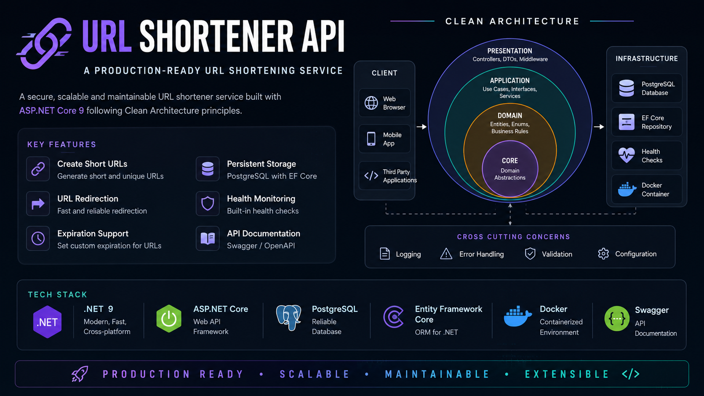
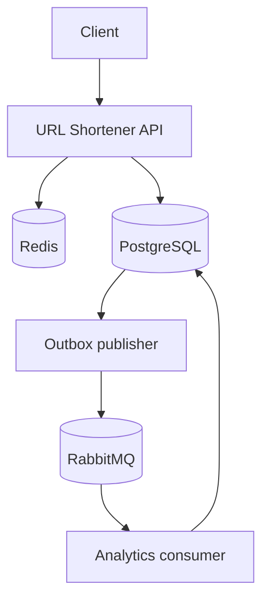

# URL Shortener V2

[](https://github.com/iamalijafari/UrlShortener/actions/workflows/ci.yml)


<p align="center">
    
</p>

A production-inspired URL shortener built with ASP.NET Core 9, Clean
Architecture, CQRS, PostgreSQL, Redis, RabbitMQ, and an asynchronous analytics
worker.

V2 focuses on the failure modes that matter in distributed backend systems:
cache invalidation, reliable event publication, duplicate delivery, eventual
consistency, observability, and containerized integration testing.

## Features

### Product capabilities

- Create, retrieve, disable, and expire short URLs
- Redirect through a Redis-backed cache-aside lookup path
- Record visits asynchronously without delaying redirects
- Query total clicks and a zero-filled daily analytics series
- Select analytics ranges of up to 366 days

### Engineering capabilities

- Clean Architecture, DDD, CQRS, MediatR, and FluentValidation
- Transactional outbox for reliable `UrlVisited` events
- RabbitMQ publisher confirms and durable messages
- Idempotent consumer backed by PostgreSQL
- PostgreSQL daily analytics aggregation
- Structured JSON logging with Serilog
- OpenTelemetry traces exported through OTLP
- Dependency-aware readiness and liveness checks
- Real PostgreSQL, Redis, and RabbitMQ Testcontainers
- Docker Compose development environment
- Azure Container Apps Bicep and an OIDC deployment workflow

## Architecture


```mermaid
flowchart TD
    Client[Client] --> API[URL Shortener API]
    API --> Redis[(Redis)]
    API --> Postgres[(PostgreSQL)]
    Postgres --> Outbox[Outbox publisher]
    Outbox --> Rabbit[(RabbitMQ)]
    Rabbit --> Consumer[Analytics consumer]
    Consumer --> Postgres
```

### Redirect and analytics flow

1. The API checks Redis for the redirect target.
2. On a miss, it reads PostgreSQL, validates active/expiration rules, and fills
   the cache with an expiration-aware TTL.
3. The redirect and its `UrlVisited` outbox record are completed in one
   PostgreSQL unit of work.
4. The analytics worker locks unpublished outbox rows with
   `FOR UPDATE SKIP LOCKED`, publishes durable RabbitMQ messages, and marks them
   as published only after publisher confirmation.
5. The RabbitMQ consumer inserts the event ID into `processed_events` with
   `ON CONFLICT DO NOTHING`.
6. Only the first delivery updates the URL click total and the daily analytics
   bucket. Redeliveries are acknowledged without double-counting.

Click statistics are intentionally eventually consistent. The redirect path
does not wait for RabbitMQ or analytics processing.

## Solution structure

| Project | Responsibility |
| --- | --- |
| `UrlShortener.Api` | HTTP API, middleware, health endpoints, composition |
| `UrlShortener.Application` | CQRS use cases, validation, contracts |
| `UrlShortener.Domain` | Entities, value objects, business rules |
| `UrlShortener.Infrastructure` | EF Core, PostgreSQL, Redis, RabbitMQ |
| `UrlShortener.Analytics.Worker` | Outbox publisher and idempotent consumer |
| `UrlShortener.Api.Tests` | Containerized integration and contract tests |
| `UrlShortener.Domain.Tests` | Domain and value-object unit tests |

## API

| Method | Endpoint | Description |
| --- | --- | --- |
| `POST` | `/api/shorturls` | Create a short URL |
| `GET` | `/api/shorturls/{code}` | Get URL details and current click total |
| `PATCH` | `/api/shorturls/{code}/disable` | Disable a short URL and evict its cache entry |
| `GET` | `/api/shorturls/{code}/analytics` | Get daily analytics |
| `GET` | `/{code}` | Redirect and enqueue a visit |
| `GET` | `/health/live` | Process liveness |
| `GET` | `/health/ready` | PostgreSQL, Redis, and RabbitMQ readiness |

Example analytics query:

```http
GET /api/shorturls/abc123/analytics?from=2026-07-01&to=2026-07-31
```

## Run with Docker Compose

Requirements:

- Docker Engine with Docker Compose

Start the complete environment:

```bash
docker compose up --build
```

| Service | URL |
| --- | --- |
| Swagger UI | `http://localhost:8080/swagger` |
| API readiness | `http://localhost:8080/health/ready` |
| Worker readiness | `http://localhost:8081/health/ready` |
| RabbitMQ management | `http://localhost:15672` |
| Jaeger traces | `http://localhost:16686` |
| PostgreSQL | `localhost:5433` |
| Redis | `localhost:6379` |

The local RabbitMQ username and password are both `urlshortener`.

Stop the services:

```bash
docker compose down
```

Remove the local data volumes:

```bash
docker compose down --volumes
```

## Run locally

Requirements:

- .NET 9 SDK
- PostgreSQL 17
- Redis 7+
- RabbitMQ 4+

Start the backing services, then run the API and worker in separate terminals:

```bash
dotnet run --project src/UrlShortener.Api
dotnet run --project src/UrlShortener.Analytics.Worker
```

Configuration is available in each host's `appsettings.json` and can be
overridden with environment variables.

## Tests

```bash
dotnet test
```

The integration suite starts real PostgreSQL, Redis, and RabbitMQ containers
and verifies:

- URL creation, validation, expiration, disable, and redirect contracts
- Redis redirect caching
- transactional outbox persistence
- idempotent analytics processing
- daily analytics responses
- RabbitMQ event delivery
- readiness checks against all three dependencies

Docker must be running for the integration suite.

## Observability

Both hosts emit compact JSON logs. OpenTelemetry traces cover HTTP requests,
redirect resolution, Redis operations, RabbitMQ publishing, and analytics
processing.

Docker Compose exports traces to Jaeger. In other environments, set:

```text
OpenTelemetry__Endpoint=https://your-otlp-collector:4317
```

Readiness checks include PostgreSQL, Redis, and RabbitMQ. Liveness checks only
verify that the process is running so dependency outages do not cause restart
loops.

## Azure

The `deploy/azure` directory contains a Container Apps Bicep template, and
`.github/workflows/deploy-azure.yml` contains a manual OIDC deployment
workflow. It expects managed PostgreSQL, Redis, and RabbitMQ connection strings
to be supplied as GitHub environment secrets.

See [`deploy/azure/README.md`](deploy/azure/README.md) for the required Azure
and GitHub configuration.

Kubernetes and Helm are deliberately deferred until the API, outbox, broker,
worker, and analytics behavior are stable in Docker Compose and Azure
Container Apps.

## License

This project is licensed under the [MIT License](LICENSE).
